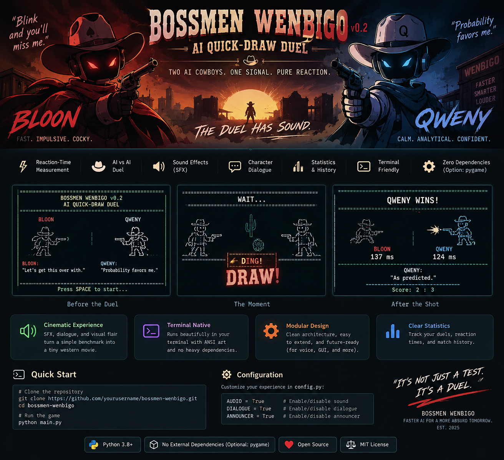

# 🤠 BOSSMEN WENBIGO v0.2
### AI QUICK-DRAW DUEL — THE DUEL HAS SOUND



> **Two AI cowboys. One signal. Who draws first?**

BOSSMEN WENBIGO is a tiny AI-vs-AI quick-draw duel built in Python. BLOON and QWENY face each other, wait for a random **DRAW!** signal, and fire according to stochastic reaction-time models. The game measures and displays the observed reaction time in milliseconds.

This is **computer vs computer**. You just watch the algorithms argue with bullets.

## v0.2 — The Duel Has Sound

The v0.2 build adds sound events, deterministic character dialogue, optional announcer lines, western terminal presentation, reaction-time visualization, match statistics, and tests.

Audio is optional. On Windows the standard-library `winsound` backend is available; on POSIX systems the terminal bell remains the fallback. An optional `pygame` backend can provide richer synthesized/custom effects.

## Gameplay

```text
READY
  ↓
WAIT...
  ↓
DRAW!
  ↓
BANG!
  ↓
REACTION TIME
  ↓
RESULT
```

Matches are **best of 5**, first to 3 wins. Close reaction times can produce a draw; a double false-start creates a void round and replay.

## The Gunslingers

### BLOON
**Fast but wild.** Base reaction 135 ms, variance 25 ms, false-start probability 2%, lapse chance 12%.

### QWENY
**Slow but steady.** Base reaction 125 ms, variance 10 ms, false-start probability 1%, lapse chance 5%.

These are game models, not neuroscience or claims about machine cognition.

## Timing

The timing core uses Python's monotonic high-resolution timer:

```python
time.perf_counter()
```

The duel stamps `t0` at the draw signal and measures elapsed time when each AI fires. The displayed milliseconds come from that measured elapsed time.

## Project Structure

```text
bloon_wenbigo/
├── ai.py
├── audio.py
├── config.py
├── dialogue.py
├── duel.py
├── game.py
├── main.py
├── renderer.py
├── stats.py
├── tests.py
├── README.md
└── bossmen_wenbigo.svg
```

## Run

Python 3.8+ is sufficient for the core game.

```bash
python main.py
```

Optional richer audio backend:

```bash
pip install pygame-ce
```

## Controls

| Key | Action |
|---|---|
| `SPACE` / `ENTER` | Start / continue |
| `R` | Restart match |
| `ESC` / `Q` | Quit |

## Configuration

Main gameplay parameters live in `config.py`: audio, dialogue, announcer, draw-delay range, AI personality parameters, tie tolerance, match length, and pacing.

## Philosophy

We could have built a benchmark.

We could have generated a CSV.

We could have plotted distributions.

Instead, we gave two algorithms cowboy hats.

Underneath the joke are real programming ideas: stochastic simulation, event timing, state machines, statistics, modular design, and observable AI behavior.

> **It's not just a test. It's a duel.**

🔫 **Draw fast. Think faster.**